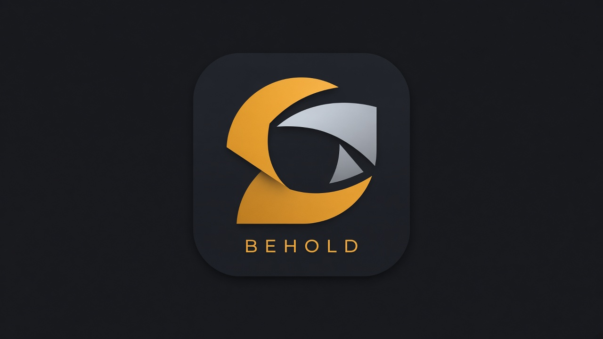

<p align="center">
  
</p>

# BEHOLD

**BEHOLD by AMIRITE.studio** — the best product-render suite for Blender. KeyShot-simple lighting, cameras, and stills, as open source.

**v1.5.0 — Per-body auto-dress.** Each STEP color / body name gets its own look. **Assist** still applies one look to the selection. **v1.4.0** is defeaturing lite. **v1.3.0** is live tessellation regenerate. **v1.2.0** is IES practical lite. **v1.1.0** is procedural gobo lite. **v1.0.0 is First stable.** The current logo is a **placeholder** (official mark in the UI still ships).

Official mark (Blender UI): [`behold/icons/behold_icon.png`](behold/icons/behold_icon.png) · Wordmark: [`docs/brand/behold_logo.png`](docs/brand/behold_logo.png) · also [`behold/icons/behold_logo.png`](behold/icons/behold_logo.png)

Primary Blender target: **5.2 LTS and newer**. Install still declares 4.2+ (`bl_info` / `blender_manifest.toml`) so older 4.x/5.1 builds can load the zip; production lighting, cameras, turntable, and materials are developed and tested against 5.2 LTS.

Living status (Implemented vs Coming) lives in **[CHECKPOINT.md](CHECKPOINT.md)**. Leveling path: **[ROADMAP.md](ROADMAP.md)**.

## Quick start

**Import → Studio → Shoot.** Open the 3D Viewport sidebar (`N`) → **BEHOLD**.

1. **Import** — **Import Product**. Mesh formats go in natively. STEP / IGES / BREP need [STEPper NEXT](#stepper-next) (or OCP fallback).
2. **Studio** — select the mesh, pick **White / Grey / Black**, click **Build**. **Catcher** (on by default) puts ground contact under the product.
3. **Shoot** — **Draft** for a fast look (**Draft = EEVEE · Final = Cycles**). Pick **Size**. Click **Still**. Switch to **Final** for the client frame.

Dress lights, materials, and cameras between Studio and Shoot. **Check for updates** lives in add-on preferences (auto-check on, once a day). See [Updates](#updates).

Faster path: pie menu **Shift+Alt+B**, or the 3D View header icons (Import / Build Studio / Still).

## Feature map

N-panel order: **Import → Studio → Lights → Materials → Cameras → Shoot → Advanced**.

| Panel | What you get |
| --- | --- |
| **Import** | **Import Product** file picker + CAD line (**STEPper NEXT ready** / **OCP fallback** / **Install STEPper NEXT**) + **Tessellation** (**Regenerate**) + **Cleanup** (fillets / chamfers / holes in mm) |
| **Studio** | White / Grey / Black + **Build** + **Catcher**, compact **HDRI**, compact **Bake HDRI** |
| **Lights** | Inventory + Light Draw + **Shape** + **Gobo** + **IES** (Load / Sample / Clear) + **Linking** |
| **Materials** | Metal / Plastic / Rubber / Glass / Paint + **Assist** (one look) + **Auto-dress** (per body) |
| **Cameras** | Add / frame product cameras + **DoF** |
| **Shoot** | Draft / Final, Still, **Size**, **Look**, **Shots**, **Batch export**, **Turntable** |
| **Advanced** | Parked extras (mixer, **Studio Margin**, CAD box, BlenderKit, bake/ease, Apply buttons) |

### Import

Mesh `.obj` `.fbx` `.stl` `.glb` `.gltf` (native 4.2+ / 5.2 LTS). `.3mf` when Blender has an importer. CAD `.step` `.stp` `.iges` `.igs` `.brep` `.brp` via **STEPper NEXT** (production on 5.1+/5.2 LTS) or OCP if STEPper is missing and bindings import. Mesh never requires STEPper. Missing CAD backend **fails loudly** with the STEPper Releases URL.

After import: optional **Build Studio** around the new mesh. Mesh files get optional **Material Assist** from the filename (`housing_aluminum.step` → **Metal**). CAD files **auto-dress per body** from STEP color and part names.

**Tessellation (1.3.0)** — **Regenerate** the last STEP / IGES / BREP without re-picking the file. **Draft / Balanced / Fine / Ultra** match STEPper NEXT physical deflection (2 mm / 0.8 mm / 0.2 mm / 0.05 mm); **Custom** is the slider. STEPper NEXT is used when it is installed; OCP is the fallback when that is what imported (or STEPper is missing). Materials and transforms stay on the product where names still match. No CAD source cached reports a sentence plus the next step. **Apply tessellation** stays in Advanced. Mesh OBJ/FBX/STL/GLB/3MF is not retessellated.

**Cleanup (1.4.0)** — product-render defeaturing lite on the same Import path, not a CAD editor. **Fillets / Chamfers / Holes** toggles plus millimetre thresholds (**Blend** default 2 mm radius/width, **Hole Ø** default 3 mm). **Regenerate** (or Import Product) runs cleanup **before** tessellate when a toggle is on. **STEPper NEXT has no fillet / chamfer / hole RNA** — cleanup needs **OCP** (`cadquery-ocp`). Missing OCP or an unsupported OCP build reports a sentence plus the next step. Defaults off so 1.3 tessellation-only regenerate stays unchanged. Not a kernel UI.

### Studio

Select the product → **Build**. The cyclorama auto-fits the world AABB (floor from XY diagonal × **Studio Margin**, default 2.0×, parked in Advanced; wall clears height with headroom). Lights sit outside the sweep. Rebuild replaces the old cyclorama.

**Catcher** sits next to **Build** (default on) — believable **ground contact**, not a second engine panel:

- Cyclorama: soft contact disc under the product (`BEHOLD_ContactShadow`)
- Solid / HDRI (Advanced backdrop): optional Cycles **shadow catcher** plane; EEVEE Draft uses light contact shadows plus a Light Path fallback

**HDRI** — Load an `.hdr` / `.exr` from disk (OpenHDRI / Poly Haven / BYO). Strength, Z rotation, optional **Reflections only**. **Reset** restores a solid studio world.

**Bake HDRI** — 1K/2K equirectangular `.exr` / `.hdr` of the light rig (product and cyclorama hidden). Optional include world / apply as world. Empty path writes next to the `.blend`.

### Lights

Add / remove / set active BEHOLD area lights. Per-light energy. Build Studio seeds Key / Fill / Rim.

- **Shape** — Softbox, Strip, Octa, Hard, Rim on the active light (size / spread / procedural falloff). **Apply to active**.
- **Gobo (1.1.0)** — **None / Blinds / Window / Circle** on the active BEHOLD **area or spot** light. Procedural nodes on the light (Wave bands / Brick panes / circular cookie). **Scale** and **Strength** when a pattern is on. **None** tears the graph down and restores the Shape falloff. Live RNA update; **Apply Gobo** stays in Advanced. Missing lights or a point/sun reports a sentence plus the next step. Empty Lights state unchanged.
- **IES (1.2.0)** — **Load** / **Sample** / **Clear** a photometric `.ies` on the active BEHOLD light. Cycles IES works on **spot and point**; area lights become spots while the profile is on. **Strength** and **Scale** when a file is set. **Clear** restores the prior type plus Shape / Gobo. Missing file or a sun reports a sentence plus the next step. One bundled CC0 `sample_spot.ies` — **bring your own `.ies`** for a real fixture. Not a streamed manufacturer catalog. **Apply IES** stays in Advanced.
- **Linking** — **Link Selected** cycles include → exclude (Cycles **light linking**). **Unlink** drops the selection, or clears the light if nothing is selected. **Solo product** includes only the product (cyclorama stays unlit). **Light / Shadow** picks receiver vs blocker collection when the 5.2 API is present.
- **Light Draw** — Aim: Active | New. Reflect / Direct / Orbit (LMB aim, scroll power/size/distance, solo).

Empty state until you Build Studio or Add Light.

### Materials

One-click **Metal / Plastic / Rubber / Glass / Paint** on the selected product mesh (not the cyclorama / catcher). **Assist** maps the filename / STEP hint onto that rack and applies **one look** to the selection — **no BlenderKit account required**. **Auto-dress (1.5.0)** assigns a look **per body** from STEP color and/or part name (same name hints as Assist). After CAD import, or on demand. Bodies with no color or name hint are skipped (sentence + next step: use Assist for one look). Signed-in BlenderKit still searches after Assist's local look lands. Empty state if nothing dressable is selected.

### Cameras

85 mm full-frame product cameras. Add / set active / frame / delete / clear. Active camera is the Shoot still (and the main-camera bookmark). Build Studio seeds `BEHOLD_Camera`.

**DoF** — on/off, **f-stop** (product default **f/5.6**), **Focus on product** (AABB center, studio sweep excluded), **Focus on selected** (facing surface). Maps to Blender 5.2 `Camera.dof`. Empty Cameras state unchanged. **Apply DoF** stays in Advanced.

### Shoot

**Draft = EEVEE · Final = Cycles.** Draft uses EEVEE Next when the build has it; Final / Product / Hero stay Cycles (256 / 128 / 512 samples, denoising). Missing EEVEE falls back to Cycles Draft and says so.

**Size** — **Square 1:1**, **Portrait 4:5**, **Landscape 16:9** with **2048²** / **1080p** / **4K** (long edge 2048 / 1920 / 3840). Writes render resolution at 100% with square pixels. Default Square 1:1 at 2048². Landscape + 1080p = 1920×1080; Landscape + 4K = 3840×2160.

**Look** — **EV** (−6 to +6), **WB** in Kelvin (D65 = 6500 K), AgX-safe **False Color**. **Clean / Catalog / Dramatic** compositor stills (Catalog = mild **vignette** + grain, bloom off; Dramatic adds stronger edges + mild bloom-safe glare). **Compositor** toggle builds / tears down BEHOLD nodes; custom trees are left alone. Light Draw **F** still toggles False Color.

**Shot Manager** — named presets (camera, quality, turntable seconds, HDRI, backdrop, output tokens). **Add / Apply / rename / Delete**. Apply does not touch the product mesh.

**Batch export** — **Front / ¾ / Top** stills, optional saved shots. Path tokens `{angle}` `{camera}` `{quality}`. Camera pose and look restore when the run finishes.

**Turntable** — one row: seconds + Setup + Play. Default **6 seconds** (**144 frames at 24 fps**) for a 360° linear loop around the product. **Play** previews (Setup first if needed). Advanced: Linear vs Ease, Bake, Clear, Render.

### Advanced

Collapsed closed. Mixer, **Studio Margin**, CAD extras, BlenderKit login / search / apply, Light Draw hotkeys, tokens / bookmark, turntable bake / ease / render, Apply Catcher / DoF / Quality / Size / Exposure / Look / Gobo / IES / tessellation / Cleanup. Operators stay registered.

### Utilities (opt-in, not a product release)

Off by default. Enable **Utilities panel** in add-on preferences to show a separate **Utilities** section (after Advanced) for a layered Danish wall and Legs / L-bracket balcony mounts. Does not change Import → Studio → Lights → Materials → Cameras → Shoot. See **[docs/UTILITIES.md](docs/UTILITIES.md)**.

## Coming (not 1.5)

Streamed IES / gobo catalogs, logo redo, Light Wrangler viewport-gizmo parity, full BlenderKit browser. Per-body auto-dress shipped in **1.5.0**. Defeaturing lite shipped in **1.4.0**. Live tessellation regenerate shipped in **1.3.0**. IES practical lite shipped in **1.2.0**. Procedural gobos shipped in **1.1.0**. See **[ROADMAP.md](ROADMAP.md)** and [CHECKPOINT.md](CHECKPOINT.md).

## STEPper NEXT

STEPper NEXT is the primary OpenCASCADE STEP/IGES/BREP importer for BEHOLD on **Blender 5.1+ / 5.2 LTS**. It is a GPL Blender **extension** (`id = "stepper_next"`) that ships bundled OCP wheels. BEHOLD does **not** vendor STEPper into the add-on zip.

**Install STEPper NEXT for CAD:**

1. Download the platform zip from **[Peak-Design/STEPper_NEXT Releases](https://github.com/Peak-Design/STEPper_NEXT/releases)**.
2. Blender → Edit → Preferences → Get Extensions → Install from Disk (or drag the zip onto Blender).
3. Enable **STEPper NEXT**. The BEHOLD Import panel should read **STEPper NEXT ready**.

If STEPper is installed but disabled, Import Product enables it. If enable fails, BEHOLD reports the module name and the Releases URL.

BEHOLD calls `bpy.ops.import_scene.occ_import_step` with an absolute `filepath` and `override_file` = basename. That stays on STEPper's synchronous importer — it does not open STEPper's full dialog. Optional STEPper RNA (`quality_preset`, `lin_deflection_len`) is passed only when those properties exist. STEPper has **no fillet / chamfer / hole RNA** — **Cleanup (1.4.0)** uses BEHOLD's OCP path (`BRepAlgoAPI_Defeaturing` / inner-wire remove) before tessellate.

On 4.2–5.0, use BEHOLD's OCP fallback (`cadquery-ocp` / `cadquery-ocp-novtk` in Blender's Python) or an older STEPper build if you have one. OCP tessellation is a thinner fallback, not STEPper quality.

Sidebar **BEHOLD → Import** (or File → Import → **BEHOLD Product**).

Prove Import → Build → Draft with the CC0 cube at [`tests/fixtures/unit_cube.step`](tests/fixtures/unit_cube.step):

```bash
make smoke-step
# blender --background --python scripts/smoke_step_vertical.py
```

## Check for updates

BEHOLD is installed from a GitHub zip, so Blender's extensions.blender.org updater does not see it. The add-on asks the public [GitHub Releases API](https://github.com/wckdboy/BEHOLD/releases) for `wckdboy/BEHOLD` — **no token**, nothing about you or your files.

1. **Auto-check** (default on) runs in the background shortly after Blender loads, at most **once per day**. Turn it off with **Check for updates** in add-on preferences.
2. Click **Check for updates** any time. Preferences show last-checked status, or **Update available: x.y.z**.
3. A light notice on the **BEHOLD** tab offers **Install** / **Open release**. **X** dismisses it until you restart Blender. Failures say **what failed** and what to try next.
4. **Install** downloads `behold-*.zip` from that release, then runs Blender 5.2 **Install from Disk** (`extensions.package_install_files` into `user_default`, overwrite + enable). Older 4.2+ builds fall back to **Add-ons → Install**.
5. **Restart Blender** to finish. The zip is in, but the old code stays in memory until restart.

If the release has no `behold-*.zip` asset, **Open release** and install the zip the same way as the first time.

## Install (Blender 5.2 LTS+)

1. Get `behold-1.5.0.zip` (GitHub Release, Actions artifact `behold-addon`, or `make zip`).
2. Blender → Edit → Preferences → Add-ons → Install… → select the zip  
   (or Get Extensions → Install from Disk).
3. Enable **BEHOLD**, then open the 3D Viewport sidebar (`N`) → **BEHOLD** tab.

The zip also loads on **4.2+** when you need it; 5.2 LTS is the production target.

**Versioned release** — push a tag `v1.5.0`. The [Build Blender add-on zip](https://github.com/wckdboy/BEHOLD/actions) workflow attaches the zip to the [GitHub Release](https://github.com/wckdboy/BEHOLD/releases). Every push / PR also uploads the `behold-addon` artifact.

```bash
git tag v1.5.0
git push origin v1.5.0

make zip
# → dist/behold-1.5.0.zip
```

Alternate (dev): copy or symlink `behold/` into your Blender `scripts/addons/` directory.

### Preferences

Edit → Preferences → Add-ons → **BEHOLD**: branding (**BEHOLD** / **by AMIRITE.studio**), Docs and Releases links, **Check for updates**, workflow strip and 3D View header toggles, this-scene Build Studio / Material Assist after Import, Quality.

### Pie and header

**3D Viewport pie** (`Shift+Alt+B`) — West Import Product · East Still · South Light Draw · North Build Studio · North-west Turntable Setup. **3D View header** — pie / Import / Build Studio / Still. Toggle the header cluster off in preferences if you want a stock header.

### BlenderKit

Local Metal / Plastic / Rubber / Glass / Paint looks **do not** need BlenderKit. Enable the official BlenderKit / Blendkit extension only if you want library search; **Log In to BlenderKit** lives under **Advanced**. BEHOLD does not re-host BlenderKit assets.

## Develop

```bash
git clone https://github.com/wckdboy/BEHOLD.git
make test
make zip
make smoke-step   # Blender + OCP or STEPper; not CI
```

`make test` is offline and CI-safe. If OCP is missing, tessellation is skipped; the unit-cube fixture is still classified as CAD.

## Remotes

- **Primary:** GitHub [`wckdboy/BEHOLD`](https://github.com/wckdboy/BEHOLD)
- **Mirror:** Origin [`wckdboy/BEHOLD`](https://cursor.com/codebase/wckdboy/BEHOLD)

```bash
git remote add origin https://github.com/wckdboy/BEHOLD.git
git remote add cursor https://origin.cursor.com/wckdboy/BEHOLD.git
```

## License

GPL-3.0-or-later — see [LICENSE](LICENSE).
